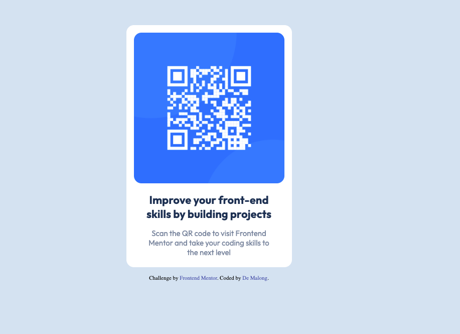

# Frontend Mentor - QR code component solution

This is a solution to the [QR code component challenge on Frontend Mentor](https://www.frontendmentor.io/challenges/qr-code-component-iux_sIO_H). Frontend Mentor challenges help you improve your coding skills by building realistic projects. 

## Table of contents

- [Overview](#overview)
  - [Screenshot](#screenshot)
  - [Links](#links)
- [My process](#my-process)
  - [Built with](#built-with)
  - [What I learned](#what-i-learned)
  - [Continued development](#continued-development)
  - [Useful resources](#useful-resources)
- [Author](#author)

**Note: Delete this note and update the table of contents based on what sections you keep.**

## Overview
Coding this challenge was fairly easy on the HTML side, but I'd found the CSS part a bit hard and it took me sometimes before I could get what I really wanted to do. 
### Screenshot

### Links

- Solution URL: [Add solution URL here](https://github.com/santino-majur/qr-code-component)
- Live Site URL: [Add live site URL here](https://santino-majur.github.io/qr-code-component/)

## My process
The process I used to get the work done was first to display all the content using HTML and then proceeded with the stylings.
### Built with

- Semantic HTML5 markup
- CSS 

### What I learned

What I learned from this challenge was how to use the max-width CSS property and also how to use the favicon.

### Continued development

Coding the challenge made me to do alot of research and I'd found a sh*t load of CSS concepts that am not aware or comfortable. I would love to master CSS(Flexbox, Grid, Animation) in the coming month.

### Useful resources

- [Example resource 1](https://www.w3schools.com/css/css_dimension.asp) - This website gave me a good understanding of width/height and max-width. I really liked the way they simplifies the content, it'll definitly be my go to website for references.

## Author

- Frontend Mentor - [@santino-majur](https://www.frontendmentor.io/profile/santino-majur)

